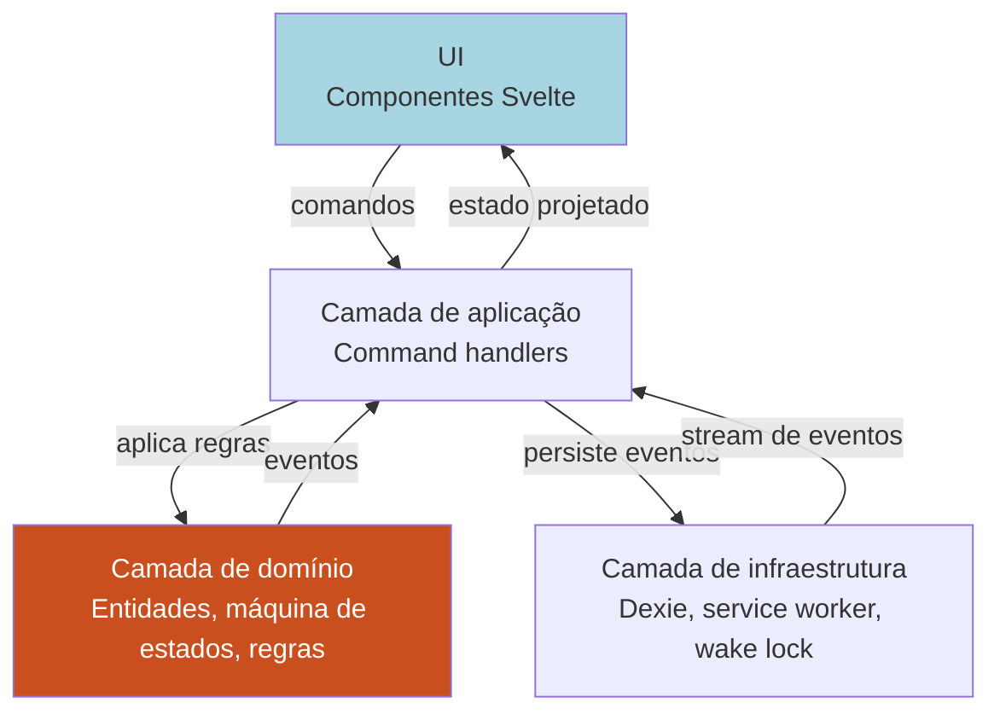
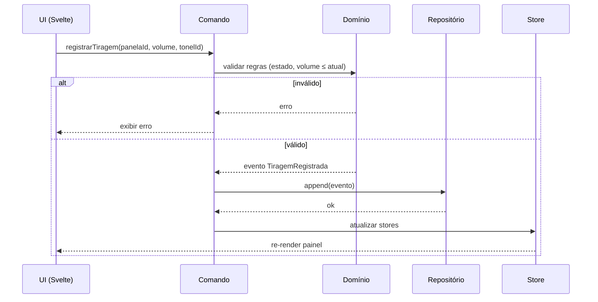
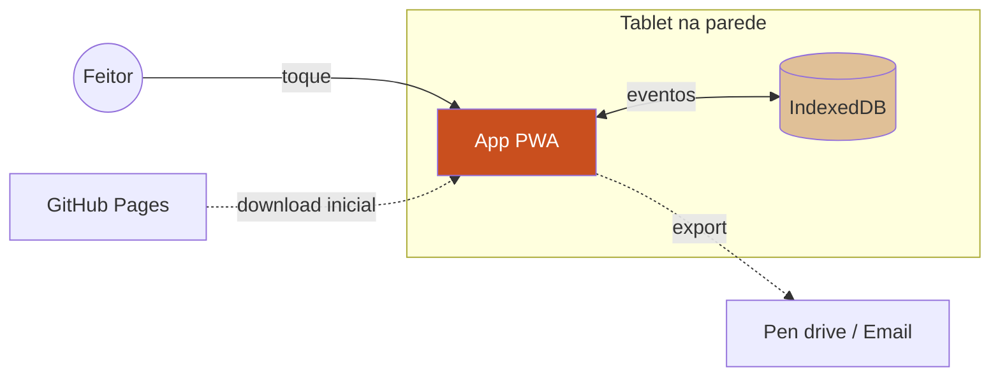

# Projeto — Aplicativo de Gestão de Feitio

> Documento de projeto técnico. Traduz os [requisitos](./requisitos.md) em decisões de arquitetura, stack e roadmap de entregas.
>
> Leitura prévia recomendada: [Tutorial de Produção do Daime](./tutorial-producao-daime.md) e [Requisitos](./requisitos.md).

---

## 1. Sumário executivo

Aplicativo **PWA offline-first** em **TypeScript**, instalável em tablet fixado na parede da casinha de feitio. Arquitetura baseada em **event sourcing** com persistência em **IndexedDB**, sem backend durante o feitio. Entrega incremental em fases — MVP utilizável logo, sofisticação depois.

---

## 2. Escolha de stack — decisões e racional

### 2.1. Plataforma: PWA (confirmado)

**Decisão:** Progressive Web App instalável.

**Motivos:**
- Atende ao requisito de tablet na parede sem loja de aplicativos.
- Funciona offline via service worker.
- Atualização simples: basta abrir e recarregar.
- Uma única base de código roda em qualquer tablet (Android, iPad, etc).
- Permite futuramente evoluir para desktop ou mobile sem reescrita.

**Implicação:** exige tablet com navegador moderno (Chrome, Safari recentes). **Não** suporta dispositivos muito antigos. Tablet alvo: Android 10+ ou iPad iOS 14+.

### 2.2. Linguagem: TypeScript

**Decisão:** TypeScript em vez de Python.

**Motivos:**
- O usuário mencionou preferência por Python, **sem apego**.
- Python em PWA é inviável sem frameworks pesados (PyScript, Brython) — perde offline e performance.
- TypeScript dá segurança de tipos, ótima tooling e é a linguagem natural para PWA.
- O domínio é rico em estados e transições — tipagem forte evita bugs de estado invalid.

**Trade-off aceito:** usuário não é atualmente fluente em TypeScript, mas a sintaxe é próxima de outras linguagens. O projeto será documentado para facilitar manutenção.

### 2.3. Framework de UI: Svelte + SvelteKit

**Decisão:** Svelte 5 com SvelteKit.

**Motivos:**
- Bundle muito pequeno (importante para primeiro load em tablet).
- Sintaxe limpa, curva de aprendizado menor que React.
- Reatividade embutida encaixa naturalmente com o modelo de estado do feitio (painel que atualiza continuamente).
- SvelteKit já resolve rotas, build, e tem suporte oficial a PWA.
- O ecossistema do repo (`svelte:*` skills disponíveis) indica alinhamento com preferências prévias.

**Alternativas consideradas:**
- **React**: mais popular, mas bundle maior e boilerplate maior.
- **Vue**: bom, mas Svelte ganha em simplicidade e performance.
- **Solid**: ótimo, mas ecossistema menor.

### 2.4. Persistência: IndexedDB via Dexie.js

**Decisão:** Dexie.js como wrapper de IndexedDB.

**Motivos:**
- IndexedDB é a única opção robusta para PWA offline (LocalStorage tem limite de 5-10 MB e é síncrono).
- Dexie é o wrapper mais maduro, com API simples e suporte a transações.
- Queries reativas via `liveQuery` se integram diretamente com Svelte stores.

### 2.5. Estado e lógica de domínio: Event Sourcing

**Decisão:** Event sourcing — eventos são a fonte da verdade; estado é derivado.

**Motivos:**
- Casa perfeitamente com o domínio: tudo que acontece no feitio é um evento (entrou no fogo, tirou, repôs, trocou).
- Habilita **desfazer** naturalmente (evento inverso ou rollback por tempo).
- Histórico completo da panela sai "de graça".
- Auditoria e exportação ficam triviais.
- Reconstrução de estado após reinício do app é trivial: replay dos eventos.

**Trade-off:** mais disciplina arquitetural. Mitigado com uma camada de domínio bem isolada.

### 2.6. Testes

**Decisão:** Vitest para unitário, Playwright para end-to-end.

**Motivos:**
- Vitest é rápido e integra com SvelteKit.
- Domínio crítico (máquina de estados, regras de nomenclatura) deve ter cobertura alta.
- E2E em Playwright valida fluxos reais do feitor.

### 2.7. Build e deploy

**Decisão:** Build estático servido de CDN ou diretamente como arquivos locais.

**Motivos:**
- Sem backend → build vira arquivos estáticos.
- Pode ser servido via GitHub Pages, Netlify, Vercel, ou mesmo de um servidor local na casinha.
- Para instalação offline: tablet baixa uma vez, service worker mantém.

### 2.8. Stack final resumida

| Camada | Escolha |
|---|---|
| Linguagem | TypeScript |
| Framework | SvelteKit + Svelte 5 |
| Estilização | Tailwind CSS (utilitário, bundle enxuto) |
| Persistência | IndexedDB via Dexie.js |
| Estado | Svelte stores + event sourcing |
| Testes unitários | Vitest |
| Testes E2E | Playwright |
| PWA | SvelteKit + Vite PWA plugin (workbox) |
| Ícones/UI | Lucide icons, componentes próprios |
| Date/time | date-fns (pequeno, tree-shakeable) |
| Build | Vite |
| Lint/format | ESLint + Prettier |
| Gerência de pacote | pnpm |

---

## 3. Arquitetura

### 3.1. Camadas



**Princípio:** o **domínio não depende de nenhuma biblioteca externa**. Ele é TypeScript puro, testável isoladamente, portável.

### 3.2. Estrutura de pastas

```
feitio-plat/
├── projeto/
│   ├── tutorial-producao-daime.md
│   ├── requisitos.md
│   └── projeto.md
├── app/
│   ├── src/
│   │   ├── domain/              # TypeScript puro — sem dependências
│   │   │   ├── entities/
│   │   │   │   ├── panela.ts
│   │   │   │   ├── tonel.ts
│   │   │   │   ├── tiragem.ts
│   │   │   │   ├── feitio.ts
│   │   │   │   └── fornalha.ts
│   │   │   ├── events/
│   │   │   │   ├── tipos.ts        # union discriminada
│   │   │   │   └── validacao.ts
│   │   │   ├── regras/
│   │   │   │   ├── nomenclatura.ts # tipo de tiragem automático
│   │   │   │   ├── maquina-estados.ts
│   │   │   │   └── correcao-duplas.ts
│   │   │   └── projecoes/          # estado derivado dos eventos
│   │   │       ├── fornalha.ts
│   │   │       ├── panelas.ts
│   │   │       └── toneis.ts
│   │   ├── app/                    # camada de aplicação
│   │   │   ├── comandos/           # command handlers
│   │   │   ├── stores.ts           # Svelte stores reativos
│   │   │   └── comandos.ts
│   │   ├── infra/
│   │   │   ├── persistencia/
│   │   │   │   ├── dexie-db.ts
│   │   │   │   └── repositorio-eventos.ts
│   │   │   ├── pwa/
│   │   │   │   └── wake-lock.ts
│   │   │   └── export/
│   │   │       ├── json.ts
│   │   │       └── pdf.ts
│   │   ├── ui/                     # componentes Svelte
│   │   │   ├── rotas/
│   │   │   ├── componentes/
│   │   │   │   ├── Fornalha.svelte
│   │   │   │   ├── Panela.svelte
│   │   │   │   ├── Tonel.svelte
│   │   │   │   └── ...
│   │   │   └── layout/
│   │   ├── routes/                 # SvelteKit
│   │   │   ├── +layout.svelte
│   │   │   ├── +page.svelte        # lista de feitios
│   │   │   ├── feitio/
│   │   │   │   └── [id]/
│   │   │   │       ├── +page.svelte    # dashboard
│   │   │   │       ├── panela/[pid]/
│   │   │   │       └── toneis/
│   │   └── app.html
│   ├── static/
│   │   ├── icons/
│   │   └── manifest.webmanifest
│   ├── tests/
│   │   ├── domain/                 # unitários do domínio
│   │   ├── app/                    # integração de comandos
│   │   └── e2e/                    # Playwright
│   ├── package.json
│   ├── svelte.config.js
│   ├── vite.config.ts
│   ├── tsconfig.json
│   └── tailwind.config.ts
└── README.md
```

### 3.3. Fluxo de um comando (exemplo: tirar panela)



### 3.4. Event sourcing — detalhes

**Evento** é um objeto imutável com:
```ts
type Evento = {
  id: string           // uuid
  feitioId: string
  tipo: TipoEvento     // enum
  momento: string      // ISO datetime
  payload: object
  versao: number       // para migração de schema
}
```

**Projeção** é uma função que percorre eventos e constrói estado derivado:
```ts
function projetarFornalha(eventos: Evento[]): EstadoFornalha { ... }
```

**Store Svelte** reativo que escuta o stream de eventos via Dexie `liveQuery` e re-projeta:
```ts
export const fornalha = derived(
  eventosDoFeitio,
  ($eventos) => projetarFornalha($eventos)
)
```

### 3.5. Persistência — schema do IndexedDB

**Tabelas:**
- `eventos` — append-only (índice por `feitioId + momento`)
- `feitios` — metadados de feitios (sobressai um pouco do event sourcing puro por conveniência)
- `pessoas` — lista de feitores cadastrados
- `configuracoes` — preferências do dispositivo

### 3.6. Invariantes e máquina de estados

Implementada como funções puras no domínio:

```ts
// domain/regras/maquina-estados.ts
export function transicao(
  estadoAtual: EstadoPanela,
  comando: Comando
): EstadoPanela | Erro {
  // valida se comando é permitido no estado atual
  // retorna novo estado ou erro
}
```

Testada com tabela de verdade exaustiva (todos estados × todos comandos).

### 3.7. Desfazer

**Estratégia:** eventos são append-only. Desfazer = inserir **evento de compensação** que zera o efeito do anterior, com referência ao evento revertido.

Alternativa considerada: snapshot + rollback. Descartada — complica sincronização futura.

### 3.8. PWA e offline

- **Service Worker** gerado via `@vite-pwa/sveltekit` com estratégia **cache-first** para assets estáticos e **network-first** para… nada (app é 100% estático).
- **Manifest.webmanifest** com ícones, nome, tema, modo standalone.
- **Wake Lock API** invocada quando feitio está `em_andamento`.
- **App Shell** pré-cacheado no primeiro load.

### 3.9. Diagrama de contexto



---

## 4. Modelo de domínio em código

### 4.1. Exemplo de tipos (esboço)

```ts
// domain/entities/panela.ts
export type EstadoPanela =
  | 'montada'
  | 'no_fogo'
  | 'fora_do_fogo'
  | 'aguardando_reposicao'
  | 'descartada'

export type TipoConteudo =
  | { tipo: 'agua' }
  | { tipo: 'cozimento'; ordem: 1 | 2 | 3 | 4 | 5 | 6 }
  | { tipo: 'agua_forte' }

export type Panela = {
  id: string
  numero: number
  estado: EstadoPanela
  conteudo: TipoConteudo | null
  volumeAtualL: number
  entradaFogoEm: string | null
  acumuladoFogoS: number
  tempoPausado: boolean
  emCicloAguaForte: boolean  // flag derivada: uma vez true, toda tiragem será agua_forte
  tiragens: Tiragem[]
}

export type TipoTiragem =
  | { tipo: 'cozimento'; ordem: 1 | 2 | 3 | 4 | 5 | 6 }
  | { tipo: 'daime'; grau: 1 | 2 | 3 | 4 }
  | { tipo: 'agua_forte' }  // sem ordem — todas iguais, mesmo tonel
```

### 4.2. Eventos como união discriminada

```ts
// domain/events/tipos.ts
export type Evento =
  | { tipo: 'feitio_iniciado'; ... }
  | { tipo: 'panela_montada'; panelaId: string; numero: number }
  | { tipo: 'panela_entra_fogo'; panelaId: string; bocaNumero: number; conteudo: TipoConteudo; volumeL: number }
  | { tipo: 'tiragem_registrada'; panelaId: string; volumeL: number; tonelDestinoId: string; tipoTiragem: TipoTiragem }
  | { tipo: 'reposicao_registrada'; panelaId: string; conteudo: TipoConteudo; volumeL: number }
  | { tipo: 'volume_ajustado'; panelaId: string; deltaL: number }
  | { tipo: 'tempo_pausado'; panelaId: string }
  | { tipo: 'tempo_retomado'; panelaId: string }
  | { tipo: 'troca_bocas'; panelaAId: string; panelaBId: string }
  | { tipo: 'panela_descartada'; panelaId: string }
  | { tipo: 'evento_desfeito'; eventoRevertidoId: string }
  | { tipo: 'feitio_encerrado' }
  // ... etc
```

Essa união discriminada dá verificação exaustiva no `switch`.

### 4.3. Regra de nomenclatura automática (RF-08)

Função pura testável:

```ts
// domain/regras/nomenclatura.ts
export function calcularTipoTiragem(panela: Panela): TipoTiragem {
  const conteudo = panela.conteudo
  if (!conteudo) throw new Error('panela sem conteúdo')

  // Uma vez em ciclo de água forte, toda tiragem é água forte — independente do conteúdo.
  // A panela volta ao fogo com água várias vezes, e cada tiragem vai para o mesmo tonel.
  if (panela.emCicloAguaForte) {
    return { tipo: 'agua_forte' }
  }

  const anteriores = panela.tiragens

  if (conteudo.tipo === 'agua') {
    const jaDeuDaime = anteriores.some(t => t.tipo === 'daime')
    const qtdCoz = anteriores.filter(t => t.tipo === 'cozimento').length
    if (jaDeuDaime) {
      // Reentrou em ciclo de água após ter dado Daime.
      // Os cozimentos produzidos aqui alimentam o tonel do 1º cozimento (misturados).
      return { tipo: 'cozimento', ordem: 1 }
    }
    const proxima = qtdCoz + 1
    if (proxima > 6) {
      // Passou dos cozimentos numerados — transiciona para ciclo de água forte.
      return { tipo: 'agua_forte' }
    }
    return { tipo: 'cozimento', ordem: proxima as 1|2|3|4|5|6 }
  }

  if (conteudo.tipo === 'cozimento') {
    // Regra explícita do tutorial: "a segunda panela nova, que entrou com o
    // segundo cozimento, chamamos isso de segundo grau". Ou seja:
    // grau do Daime = ordem do cozimento que a panela está consumindo,
    // independente do histórico de Daimes anteriores da panela.
    const grau = conteudo.ordem
    if (grau > 4) {
      // Cozimentos de ordem 5+ não viram Daime — transita para água forte.
      return { tipo: 'agua_forte' }
    }
    return { tipo: 'daime', grau: grau as 1|2|3|4 }
  }

  // conteudo.tipo === 'agua_forte' (reposição explícita, raro)
  return { tipo: 'agua_forte' }
}
```

**Efeito colateral implícito:** quando a função retorna `agua_forte`, o *command handler* deve marcar `panela.emCicloAguaForte = true` ao registrar a tiragem. A partir daí todas as tiragens seguintes são `agua_forte` automaticamente.

Testada com casos do tutorial — incluindo o cenário crítico de **múltiplas tiragens de água forte consecutivas** da mesma panela.

---

## 5. UI — decisões de design

### 5.1. Princípios visuais

- **Alto contraste** (branco/amarelo sobre fundo escuro, ou vice-versa).
- **Tipografia grande** — feitor pode estar a 2 m do tablet.
- **Cores do domínio**:
  - Água: azul
  - Cozimento: marrom terra (do jagube)
  - Daime: vinho escuro
  - Água forte: cinza
  - Boca com fogo: laranja/vermelho
- **Ícones simbólicos** (chama, gota, panela) complementam texto.

### 5.2. Protótipo da tela principal (layout ASCII)

```
┌──────────────────────────────────────────────────────────────┐
│  Feitio de Abril/2026        Feitor: José        14:32       │
├──────────────────────────────────────────────────────────────┤
│                                                              │
│   ╭────────╮  ╭────────╮  ╭────────╮                         │
│   │BOCA 1  │  │BOCA 2  │  │BOCA 3  │                         │
│   │Panela 1│  │Panela 2│  │Panela 3│                         │
│   │1º Coz  │  │1º Coz  │  │1º GRAU │                         │
│   │58 L    │  │60 L    │  │60 L    │                         │
│   │00:47   │  │00:45   │  │01:12   │                         │
│   │→ 30 L  │  │→ 30 L  │  │→ 18 L  │                         │
│   ╰────────╯  ╰────────╯  ╰────────╯                         │
│   ╭────────╮  ╭────────╮                                     │
│   │BOCA 4  │  │BOCA 5  │                                     │
│   │vazia   │  │Panela 4│                                     │
│   │        │  │2º GRAU │                                     │
│   │+ Nova  │  │55 L    │                                     │
│   │        │  │00:30   │                                     │
│   ╰────────╯  ╰────────╯                                     │
│                                                              │
├──────────────────────────────────────────────────────────────┤
│  Tonéis:  1º Coz: 62 L  |  2º Coz: 60 L  |  3º Coz: 31 L     │
│           Daime 1º: 18 L                                     │
├──────────────────────────────────────────────────────────────┤
│  [+ Nova panela]  [Tonéis]  [Apurar]  [⎌ Desfazer]           │
└──────────────────────────────────────────────────────────────┘
```

### 5.3. Responsividade

- **Tablet em pé (portrait)**: grade vertical, tonéis no rodapé.
- **Tablet deitado (landscape)**: grade horizontal, tonéis na lateral.
- **Celular**: ainda funcional para consultas, não foco primário.

---

## 6. Roadmap — fases de entrega

### Fase 0 — Setup (1–2 dias)

- Bootstrap SvelteKit + TypeScript + Tailwind
- Configurar PWA (vite-pwa)
- Configurar Dexie, Vitest, Playwright
- CI básico no GitHub Actions (lint + test + build)

### Fase 1 — MVP offline (2–3 semanas)

Entrega: **feitor consegue rodar um feitio completo pelo tablet**.

- Cadastro de feitio
- Dashboard da fornalha (RF-02)
- CRUD de panela: criar, entrar no fogo, tirar, repor, descartar
- Máquina de estados completa
- Nomenclatura automática (RF-08)
- Tonéis básicos (RF-12) — criação, depósito, retirada, volume
- Persistência via event sourcing em IndexedDB
- Funciona offline como PWA instalável
- Testes unitários do domínio com cobertura alta

**Critério de "pronto":** feitor da casinha consegue usar num feitio real sem suporte.

### Fase 2 — Refinamentos operacionais (1–2 semanas)

- Pausar/retomar tempo (RF-05)
- Swap entre bocas (RF-10)
- Sugestão de meta (RF-16)
- Correção de duplas (RF-17)
- Desfazer última ação (RF-20)
- Wake lock
- Ajuste de UI baseado em feedback do feitor após Fase 1

### Fase 3 — Apuração e litragem (1–2 semanas)

- Apuração estruturada (RF-13)
- Litragem / engarrafamento (RF-14)
- Resumo final do feitio e exportação JSON/PDF (RF-19, RNF-09)
- Histórico completo por panela (RF-15)

### Fase 4 — Qualidade e operação (contínuo)

- Testes E2E cobrindo fluxos principais
- Hardening de erros e edge cases
- Documentação de uso para feitores
- Documentação de desenvolvimento

### Fases futuras (pós-v1)

- Sincronização opcional entre dispositivos (se necessário)
- Gestão entre feitios (estoque, histórico)
- Multi-casinha
- Relatórios analíticos
- Versão desktop (Electron/Tauri wrapping a mesma PWA)

---

## 7. Entregáveis por fase — checklist

### Fase 0

- [ ] Repositório iniciado em `app/`
- [ ] `pnpm create svelte@latest` + config
- [ ] PWA manifest e service worker
- [ ] Dexie configurado
- [ ] Vitest rodando
- [ ] Playwright rodando
- [ ] README de desenvolvimento

### Fase 1 (MVP)

- [ ] Domínio com testes
  - [ ] Máquina de estados
  - [ ] Nomenclatura automática
  - [ ] Projeções
- [ ] Persistência de eventos
- [ ] UI da fornalha
- [ ] UI de panela (detalhe + ações)
- [ ] UI de tonéis
- [ ] Cadastro de feitio
- [ ] Instalação como PWA testada em tablet real

### Fase 2

- [ ] Pausar/retomar
- [ ] Swap
- [ ] Desfazer
- [ ] Wake lock
- [ ] Ajustes de UX pós-feedback

### Fase 3

- [ ] Apuração completa
- [ ] Litragem
- [ ] Exportação JSON e PDF
- [ ] Resumo final

---

## 8. Estratégia de validação com o feitor

O domínio é complexo e existe risco de dissonância entre o que a gente modela e o que o feitor vive. Para mitigar:

1. **Fase 1 termina com uso real** em um feitio, ainda em paralelo com o método atual (giz na panela) — não substituir, complementar.
2. **Feedback capturado** em cada dia do feitio (o que confundiu, o que faltou, o que sobrou).
3. **Ajustes focados** em Fase 2 baseados nesse feedback.
4. **Fase 3 só avança** depois do feitor aprovar o MVP.

---

## 9. Decisões em aberto — perguntas para o dono do projeto

Pontos que não ficaram definidos e precisam de sua entrada antes de começar a implementação:

1. **Nome do app** — tem preferência? Sugestões: "Feitio", "Casinha", "Panela", algo específico do local?
2. **Tablet alvo** — modelo específico já definido? Tamanho de tela? Sistema operacional?
3. **Casinha específica vs genérica** — a primeira versão deve ser só para a casinha onde você faz feitio, ou já pensar em genérica desde o início?
4. **Deploy** — tem servidor/domínio, ou servimos de GitHub Pages?
5. **Idioma do código** — variáveis e funções em português (aderência ao domínio) ou inglês (convenção técnica)? Recomendação: **português para termos do domínio**, inglês para termos técnicos genéricos (ex: `Panela.estado`, `db.open()`).
6. **Capacidade típica das panelas** — 120 L é o máximo que você mencionou. Qual é o comum? Isso ajuda a calibrar padrões.
7. **Limite de cozimentos** — usei 6 (baseado na transcrição). É fixo ou varia?
8. **Feedback pós-Fase 1** — quando é o próximo feitio previsto? Isso define o timeline real.

---

## 10. Riscos técnicos e mitigações

| Risco | Probabilidade | Impacto | Mitigação |
|---|---|---|---|
| IndexedDB corrompe após queda de energia | Baixa | Alto | Transações atômicas no Dexie + export periódico |
| Tablet não suporta Wake Lock | Média | Médio | Fallback: manter reprodução de vídeo silencioso oculto |
| Service worker fica com cache antigo após deploy | Alta | Médio | Estratégia de versionamento + botão "Atualizar app" |
| Feitor muda o fluxo em campo e app não suporta | Alta | Alto | Permitir sobrescrever sugestões (RF-08) + modo "evento livre" para anotações |
| Build cresce e fica lento no tablet | Baixa | Médio | Monitorar bundle size; Svelte ajuda; lazy load de rotas |
| Complexidade do domínio vira bolha de lógica | Média | Alto | Isolar domínio em TS puro + testes exaustivos |

---

## 11. Métricas de sucesso

**Técnicas:**
- Cobertura do domínio ≥ 90%
- Bundle inicial < 300 KB (gzip)
- Tempo de abertura < 3 s no tablet alvo
- Zero perda de dados em teste de queda de energia
- Funciona 100% offline após primeiro carregamento

**De negócio:**
- Feitor completa um feitio inteiro usando só o app (sem giz na panela) — Fase 2+
- Tempo médio para registrar uma tiragem ≤ 15 s
- Zero eventos perdidos entre dias do feitio

---

## 12. Próximos passos imediatos

1. **Revisar este documento e os requisitos** com o dono do projeto. Capturar ajustes.
2. **Responder decisões em aberto** (seção 9).
3. **Iniciar Fase 0** (setup do repositório e stack).
4. **Prototipar a tela da fornalha** em Svelte como primeiro entregável visível.
5. **Validar o protótipo visual** com o feitor antes de escalar.

---

*Fim do documento de projeto. Qualquer ajuste em requisitos ou projeto deve ser feito nos arquivos correspondentes e versionado com commit descritivo.*
