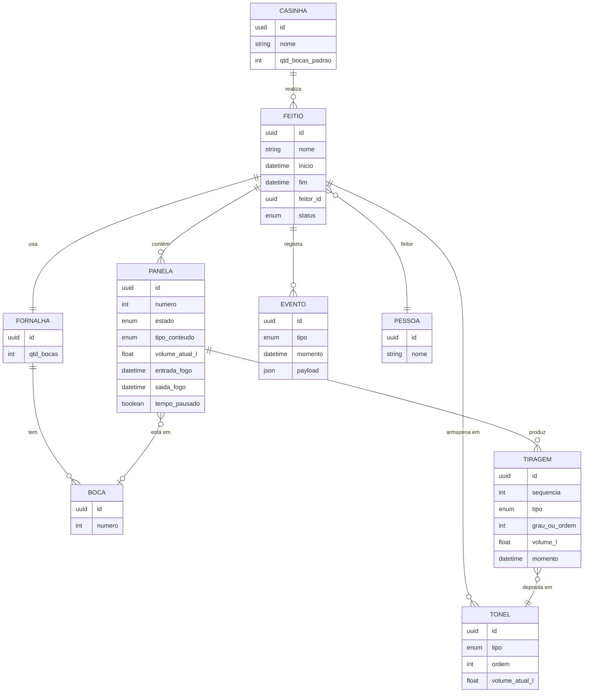
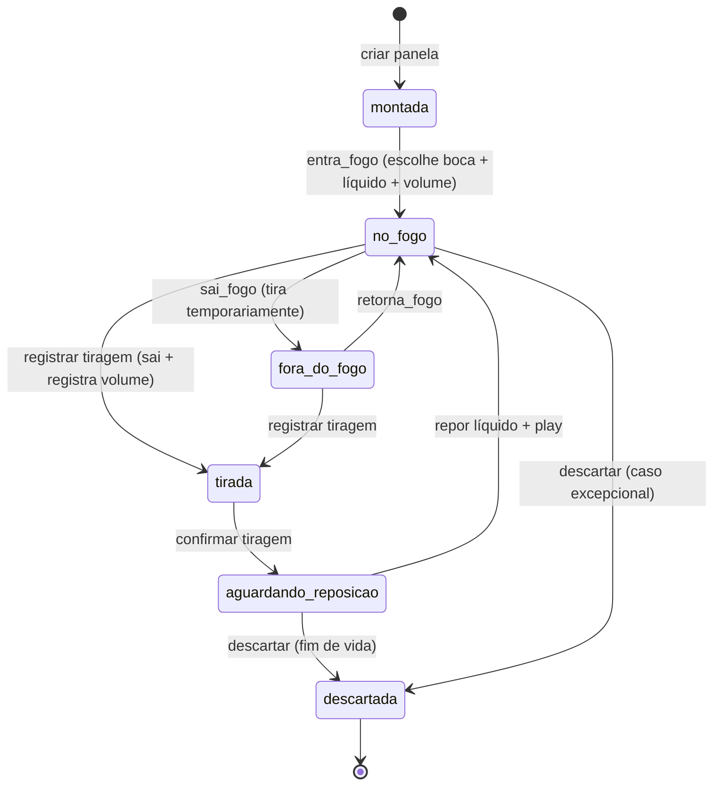
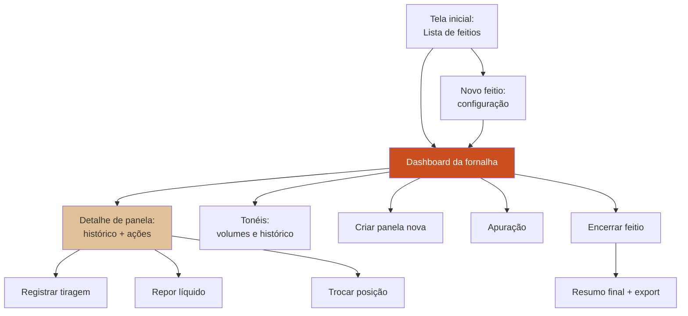
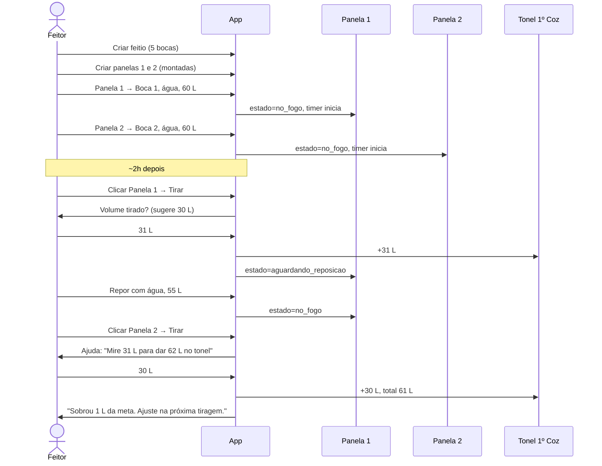
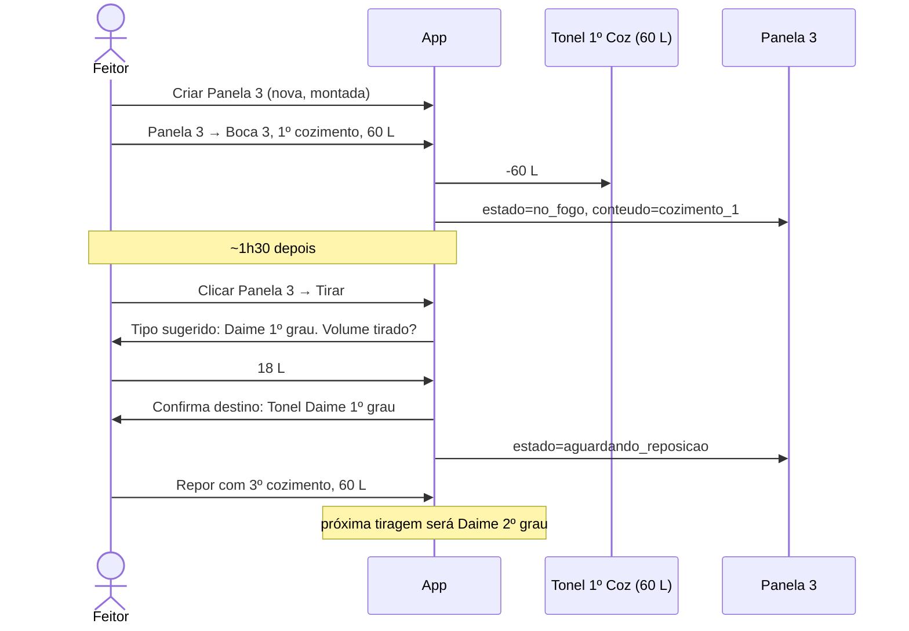
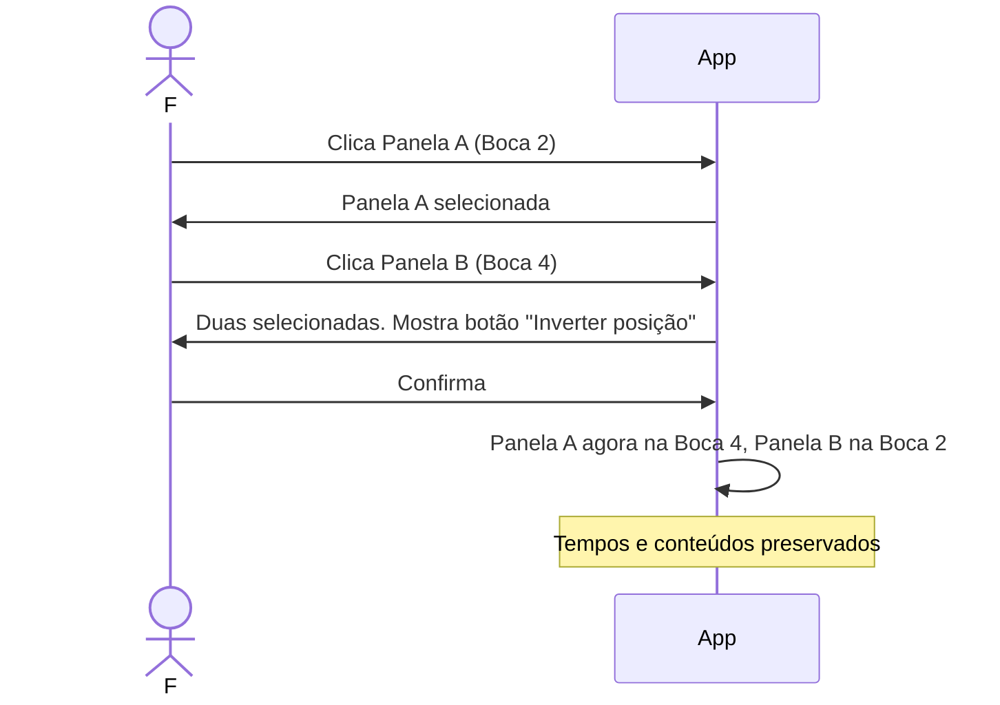

# Requisitos — Aplicativo de Gestão de Feitio

> Documento de requisitos funcionais e não-funcionais para o aplicativo que apoia a realização de um feitio de Santo Daime, com foco na casinha de feitio.
>
> Baseado no [Tutorial de Produção do Daime](./tutorial-producao-daime.md), que é a referência conceitual obrigatória.

---

## 1. Visão geral

### 1.1. Objetivo

Reduzir a carga cognitiva do **feitor** durante a realização de um feitio, substituindo o registro manual (giz/caneta nas panelas, memória) por um painel digital que mostre, em tempo real, o estado de todas as panelas, volumes, tempos, tonéis e o histórico do feitio.

### 1.2. Usuário principal

- **Feitor** — quem conduz o feitio e opera o aplicativo. Perfil: pode ter pouca instrução formal, pouca familiaridade com tecnologia. A interface precisa ser **muito simples, visual e com linguagem próxima da que se usa na casinha**.

### 1.3. Contexto de uso

- **Casinha de feitio** — ambiente quente, úmido, com fumaça, mãos ocasionalmente molhadas ou sujas.
- **Tablet fixo na parede**, tela sempre ligada, grande o suficiente para leitura a alguns metros de distância.
- **Offline-first**: não pode depender de internet. A casinha pode não ter rede.
- **Sessão longa**: um feitio dura de 2 a 5 dias. A aplicação precisa sustentar sessões longas sem perder estado.

### 1.4. Não-objetivos (fora de escopo desta versão)

- Gestão de estoque de matéria-prima entre feitios.
- Gestão financeira ou contábil.
- Distribuição e venda do Daime.
- Gestão de múltiplas casinhas em rede.
- Autenticação multi-usuário complexa (ver item 8).

---

## 2. Glossário de domínio

Usar os termos exatamente como o feitor usa. Referência no [tutorial](./tutorial-producao-daime.md#13-glossário-rápido).

| Termo no domínio | Termo no código/UI |
|---|---|
| Feitio | `feitio` |
| Casinha de feitio | `casinha` |
| Fornalha | `fornalha` |
| Boca | `boca` |
| Panela | `panela` |
| Feitor | `feitor` |
| Encarregado (substitui o feitor em ausência) | `encarregado` |
| Foguista | `foguista` |
| Paneleiro | `paneleiro` |
| Baldeiro | `baldeiro` |
| Jagube / Cipó / **Rei** | `jagube` |
| Chacrona / Folha / **Rainha** | `folha` |
| Fibra (de jagube) | `fibra` |
| Pó (de jagube) | `po` |
| Batenção (separa fibra e pó) | `batencao` |
| Tiragem | `tiragem` |
| Cozimento (1º…6º) | `cozimento` com `ordem` |
| Água forte (múltiplas tiragens) | `agua_forte` |
| Daime (1º…4º grau) | `daime` com `grau` |
| Daime do Mestre (= Daime de 1º grau) | `daime` com `grau=1` |
| Mel d'água | `mel_dagua` |
| Apuração (2x1, 3x1) | `apuracao` com `razao` |
| Tonel | `tonel` |

---

## 3. Modelo de dados

### 3.1. Entidades principais



### 3.2. Entidades detalhadas

#### `Casinha`

Representa o local físico. Permite que futuramente haja várias (ex: casinha daqui, casinha de Brasília).

Campos:
- `id`
- `nome` (ex: "Casinha da Sede")
- `qtd_bocas_padrao` (int, padrão da fornalha)

#### `Feitio`

Um feitio individual (ex: "Feitio de abril/2026").

Campos:
- `id`
- `nome`
- `inicio` (datetime)
- `fim` (datetime, nullable)
- `feitor_id` (pessoa — papel principal)
- `foguista_id` (pessoa, nullable — opcional)
- `paneleiros_ids` (lista de pessoas, nullable — opcional)
- `baldeiros_ids` (lista de pessoas, nullable — opcional)
- `casinha_id`
- `status` — enum: `em_preparo` | `em_andamento` | `encerrado`

> **Sobre papéis:** o feitor é obrigatório; os demais são informativos e servem para registro histórico. A UI v1 pode exibir apenas campo livre de texto para "equipe do feitio", evoluindo depois para cadastro estruturado.

#### `Fornalha` e `Boca`

A fornalha é 1:1 com o feitio (ou com a casinha, conforme escolha). Cada fornalha tem N bocas numeradas.

Campos da Boca:
- `id`
- `numero` (1 a N)
- `fornalha_id`
- `panela_atual_id` (nullable — pode estar vazia)

#### `Panela`

Objeto central. Tem ciclo de vida e conteúdo variável.

Campos:
- `id`
- `feitio_id`
- `numero` (ordem de entrada no feitio: panela 1, 2, 3...)
- `boca_atual_id` (nullable)
- `estado` — enum (ver seção 4): `montada` | `no_fogo` | `fora_do_fogo` | `tirada` | `aguardando_reposicao` | `descartada`
- `tipo_conteudo` — enum: `agua` | `cozimento_1` | `cozimento_2` | ... | `cozimento_6` | `agua_forte`. Define o que está na panela AGORA.
- `em_ciclo_agua_forte` (bool) — quando `true`, todas as tiragens seguintes serão registradas como `agua_forte`, mesmo que a panela seja realimentada com água. Flag derivada/cacheada do histórico.
- `volume_atual_l` (float, litros no momento)
- `entrada_fogo` (datetime, último momento em que entrou)
- `saida_fogo` (datetime, nullable)
- `tempo_pausado` (bool)
- `acumulado_tempo_fogo_s` (int, segundos totais somados através das pausas)

#### `Tiragem`

Cada vez que a panela sai do fogo e tem líquido retirado, isso é uma tiragem.

Campos:
- `id`
- `panela_id`
- `sequencia` (1ª, 2ª, 3ª tiragem daquela panela)
- `tipo` — enum: `cozimento` | `daime` | `agua_forte`
- `grau_ou_ordem` — int (1º, 2º, 3º...). Para cozimento é a ordem; para Daime é o grau. **Para água forte é sempre `null`** — água forte não tem numeração, todas as tiragens vão juntas ao mesmo tonel.
- `volume_l` — float (volume tirado)
- `momento` — datetime
- `tonel_destino_id` — destino do líquido

#### `Tonel`

Armazena líquido por tipo.

Campos:
- `id`
- `feitio_id`
- `tipo` — enum: `cozimento` | `daime` | `agua_forte` | `apuracao` | `mel_dagua`
- `ordem` — int (ex: tonel do 1º cozimento, 2º cozimento...). Nullable para tipos que não têm ordem.
- `grau` — int nullable (para tonéis de Daime por grau, se separados)
- `volume_atual_l` — float

#### `Evento` (log imutável)

Todo ato do feitor vira um evento registrado. Serve para auditoria, desfazer e replay.

Tipos de evento:
- `feitio_iniciado`
- `panela_montada`
- `panela_entra_fogo`
- `panela_sai_fogo`
- `tiragem_registrada`
- `reposicao_registrada`
- `volume_ajustado`
- `tempo_pausado`
- `tempo_retomado`
- `panela_trocada_boca` (swap)
- `panela_descartada`
- `apuracao_iniciada`
- `apuracao_finalizada`
- `feitio_encerrado`

---

## 4. Máquina de estados da panela



**Transições permitidas:**

| De | Para | Ação | Dados necessários |
|---|---|---|---|
| `montada` | `no_fogo` | Entrar no fogo | boca, tipo_conteudo, volume_l |
| `no_fogo` | `fora_do_fogo` | Pausar / sair temporário | — |
| `fora_do_fogo` | `no_fogo` | Retomar | — |
| `no_fogo` \| `fora_do_fogo` | `tirada` | Tirar e registrar volume | volume_l tirado, tonel_destino |
| `tirada` | `aguardando_reposicao` | Confirmar | — |
| `aguardando_reposicao` | `no_fogo` | Repor e dar play | tipo_conteudo novo, volume_l reposto |
| `aguardando_reposicao` | `descartada` | Descartar | motivo opcional |

> **Nota sobre água forte:** "água forte" não é um estado da panela, é uma característica do **conteúdo** (`tipo_conteudo`) e do **ciclo** em que ela está (flag `em_ciclo_agua_forte`). Uma panela em ciclo de água forte continua passando pelos mesmos estados (`no_fogo` → `tirada` → `aguardando_reposicao` → `no_fogo`...) — a diferença é que toda tiragem é registrada como `agua_forte` e toda reposição é com água. O ciclo se repete quantas vezes o feitor quiser até a transição final para `descartada`.

---

## 5. Requisitos funcionais

### RF-01 — Cadastro de feitio

**Dado** que o aplicativo está instalado e aberto,
**quando** o feitor inicia um novo feitio,
**então** o sistema deve solicitar:
- Nome do feitio (opcional, com sugestão automática `Feitio de {mês}/{ano}`)
- Quantidade de bocas da fornalha (com valor padrão da casinha)
- Nome do **feitor** (pode ser selecionado de pessoas já cadastradas ou criado) — obrigatório
- Nome do **foguista** (opcional)
- Lista de **paneleiros** e **baldeiros** (opcional — pode ser campo livre em v1)
- Data/hora de início (pré-preenchida com agora)

### RF-02 — Painel da fornalha (dashboard principal)

A tela principal do aplicativo deve mostrar **visualmente a fornalha** com N bocas, onde:

- Cada boca é desenhada como um círculo/elemento grande, numerado.
- Se a boca tem panela, mostra:
  - **Número da panela** (ex: "Panela 3")
  - **Conteúdo atual** (ex: "1º Cozimento", "2º Grau", "Água")
  - **Tempo no fogo** (timer vivo: `00:47:12`)
  - **Volume atual** (ex: "58 L")
  - **Meta de tiragem**, se definida (ex: "tirar em 30 L")
  - **Indicador visual** se está pausada
- Se a boca está vazia, mostra claramente "vazia" com botão para adicionar panela.

Deve ser legível a pelo menos **2 metros** (fontes grandes, alto contraste).

### RF-03 — Criar panela nova no feitio

**Quando** o feitor cria uma nova panela,
**então** o sistema pergunta:
- Quantas panelas novas (1 ou 2 — o comum é a dupla)?
- Quais bocas elas vão ocupar?
- **Com o que entram?** Opções:
  - Água
  - 1º cozimento (se houver tonel com volume suficiente)
  - 2º cozimento (idem)
  - 3º cozimento... etc.
- Volume inicial (com sugestões: 60 L, 55 L, 50 L, ou valor livre)
- **Meta de tiragem** (Fase 6): pergunta quanto o feitor pretende tirar desta entrada — pills rápidas 30/40/50 L ou valor livre. Campo **opcional**; quando ausente, o sistema usa heurística `volume/2`.

O sistema deve **validar** que o tonel escolhido tem volume suficiente e **descontar** do tonel.

### RF-04 — Iniciar tempo (play)

Ao confirmar entrada no fogo, o timer da panela começa a contar. Mostra `HH:MM:SS` desde a entrada.

### RF-05 — Encostar panela / voltar ao fogo

Ao clicar em uma panela **no fogo**, deve haver opção **Encostar** — usada quando a panela sai do fogo temporariamente (não para tirar, mas por outro motivo). Ao encostar:

- A panela sai da fornalha, **liberando a boca** para outra panela.
- Aparece na seção **"Panelas encostadas"** (abaixo dos Tonéis) com volume, conteúdo e "parada há HHhMM".
- Clique na panela encostada abre modal com duas opções:
  - **Voltar ao fogo**: pergunta qual boca livre — composição atômica `tempo_retomado` + `panela_entra_fogo`.
  - **Tirar material direto**: abre o sub-form de tiragem mesmo com a panela encostada (`registrar_tiragem` é permitido em `fora_do_fogo`).

O timer da entrada no fogo reseta ao voltar ao fogo (nova entrada). O timer "parada há" marca o tempo desde o último `tempo_pausado`.

### RF-06 — Adicionar líquido

Em uma panela no fogo, deve ser possível **acrescentar volume** (ex: +5 L, +10 L). UI com botões rápidos de valores comuns (5, 10) e um campo numérico para valor livre.

### RF-07 — Registrar tiragem

**Quando** o feitor decide tirar uma panela,
**então** o fluxo é:

1. Clica na panela → opção "Tirar".
2. Sistema calcula automaticamente:
   - **Tipo da tiragem**: baseado no `tipo_conteudo` atual e na regra de domínio.
     - Entrou com água, 1ª tiragem → `cozimento` ordem 1
     - Entrou com água, 2ª tiragem → `cozimento` ordem 2
     - Entrou com 1º cozimento, 1ª tiragem → `daime` grau 1
     - Entrou com 1º cozimento, 2ª tiragem (então repôs com 2º coz? ou 3º?) → ver RF-09
     - Panela já "velha" → `agua_forte`
3. Pergunta o **volume tirado**.
4. Pergunta o **tonel destino** (pré-selecionado pelo tipo).
5. Confirma.
6. Panela vai para estado `aguardando_reposicao`.

### RF-08 — Regra de nomenclatura automática

O sistema deve **calcular sozinho** o tipo da tiragem baseado no conteúdo atual da panela e no histórico de tiragens dela:

```
SE conteudo_atual == "agua" E panela NUNCA tirou daime:
    # ciclo inicial de cozimentos
    tipo = "cozimento"
    ordem = numero_de_cozimentos_ja_tirados_desta_panela + 1
    SE ordem > limite_cozimentos (default 6):
        tipo = "agua_forte"   # entra no ciclo de água forte (múltiplas tiragens)

SENÃO SE conteudo_atual começa com "cozimento_":
    # panela alimentada com cozimento → produz Daime
    # REGRA: grau = ordem do cozimento que entrou na panela
    # (tutorial: "a segunda panela nova, que entrou com o segundo cozimento,
    #  chamamos isso de segundo grau" — não depende de histórico)
    tipo = "daime"
    grau = ordem_do_cozimento_atual
    SE grau > 4:
        tipo = "agua_forte"   # cozimentos ordem 5+ não viram Daime

SENÃO SE conteudo_atual == "agua" E panela JÁ tirou daime:
    # voltou a ser alimentada com água após ciclo de Daime
    # agora produz cozimento novamente (vai ao tonel do 1º coz, misturado)
    tipo = "cozimento"
    ordem = 1

SENÃO SE conteudo_atual == "agua_forte" OU panela já está em ciclo de água forte:
    # IMPORTANTE: água forte NÃO é tiragem única
    # a panela continua voltando ao fogo com água quantas vezes render
    # cada tiragem dessas é registrada como agua_forte (sem ordem numérica)
    tipo = "agua_forte"
```

**Ponto crítico sobre água forte:**
- Uma vez que a panela entra em "água forte", **todas as tiragens seguintes são água forte** até a panela ser descartada.
- Não há numeração (`agua_forte_1`, `agua_forte_2`…). Todas as tiragens vão para o **mesmo tonel de água forte**.
- A panela volta ao fogo **sempre com água** (nunca com cozimento) durante o ciclo de água forte.
- Só o feitor decide quando descartar — o sistema não força.

O feitor pode **sobrescrever** a sugestão manualmente caso o sistema se engane.

### RF-09 — Repor líquido após tiragem

Após tiragem confirmada, panela entra em `aguardando_reposicao`. Sistema pergunta:

- **Com o que repor?** Sugestões inteligentes baseadas no próximo passo lógico:
  - Se panela acabou de dar 1º cozimento → sugere "água" (continuar cozinhando) OU "descartar".
  - Se panela acabou de dar Daime 1º grau → sugere "3º cozimento" (para virar 2º grau na próxima).
  - Se panela está no **ciclo de água forte** → **sugere apenas "água"** (não oferece cozimento como opção principal, pois no ciclo de água forte só se repõe água).
  - Sempre permite escolher livremente, inclusive sobrescrever a sugestão.
- **Volume a repor** (com botões de 60, 55, 50, 45, ou valor livre).

O sistema **desconta do tonel** escolhido (quando aplicável — água pura não sai de tonel).

### RF-10 — Trocar panelas de lugar (swap entre bocas)

**Quando** o feitor seleciona duas panelas (clica uma, clica outra),
**então** aparece botão "Inverter posição".
Ao confirmar, as duas panelas trocam de boca. **Não há mudança de tempo ou conteúdo**, só de posição física.

### RF-11 — Descartar panela (fim de vida)

Panelas em `aguardando_reposicao` ou `no_fogo` (em caso excepcional) podem ser marcadas como descartadas. A panela some da fornalha, o material é considerado fora.

### RF-12 — Gestão dos tonéis

Tela dedicada ou painel lateral mostrando:
- Cada tonel com seu **tipo** (1º coz, 2º coz, Daime 1º grau, água forte...)
- **Volume atual**
- **Histórico de depósitos e retiradas**
- Permite ajuste manual de volume (correção de medida) com registro de evento.

### RF-13 — Apuração

Quando o feitio entra na fase de apuração:

- Sistema permite criar uma **apuração** juntando conteúdo de tonéis escolhidos (Daime 2º+3º+4º, ou sobras).
- Feitor define **razão** (2x1, 3x1, outro).
- Sistema registra **volume de entrada** e **volume alvo de saída**.
- Panela/caldeirão de apuração é tratada como uma panela normal em termos de UX (está em boca, no fogo, tempo contando).
- Ao tirar, gera **Daime apurado** ou **mel d'água** (tipo da tiragem escolhido).

### RF-14 — Litragem (engarrafamento)

- Permite registrar saída de volume do tonel de Daime (1º grau, apurado, mel d'água) para "engarrafamento".
- Reduz volume do tonel correspondente.
- Registra evento `litragem`.

### RF-15 — Histórico da panela

Clicar em uma panela e ver "Ver histórico" deve mostrar linha do tempo:
- Montada às 14:00
- Entrou na boca 2 com 60 L de água às 14:05
- Pausada por 3 min
- Tirada 30 L (1º cozimento) às 16:30, foi para tonel A
- Reposta com 55 L de água às 16:35
- ... etc.

### RF-16 — Sugestão de meta de tiragem

Ao iniciar ou repor uma panela, sistema sugere **meta de volume ao tirar** baseada em regras de domínio (padrão: metade do volume de entrada, ajustável). Mostra essa meta no painel da fornalha.

### RF-17 — Correção de duplas (ajuda ao feitor)

Quando duas panelas alimentam um tonel que precisa de volume exato (ex: 60 L para formar panela nova):

- Sistema mostra quanto **falta ou sobra** para a meta do tonel após cada tiragem.
- Exemplo: "Panela 1 deu 33 L. Para chegar a 62 L no tonel, mire 29 L na panela 2."
- Ajuda de decisão, não decide sozinho. O feitor pode ignorar.

### RF-18 — Trocar feitor no meio do feitio

Permite registrar que outro feitor assumiu a partir de um horário. Histórico preserva quem fez cada evento.

### RF-19 — Encerrar feitio

Ao final, feitor marca `feitio_encerrado`. Sistema gera:
- Resumo: total de panelas, total de Daime produzido por tipo, volumes finais de tonéis.
- Exportação opcional (PDF/JSON).

### RF-20 — Desfazer última ação

Dada a probabilidade de erros de operação em ambiente estressante, deve haver **"desfazer"** para pelo menos a última ação. Desfazer reverte o evento mais recente.

### RF-21 — Editar panela (correção append-only)

Ao clicar numa panela **no fogo**, o modal de detalhe deve oferecer um botão **Editar** que abre um sub-form com os campos:

- Número da panela
- Volume atual (L)
- Meta de tiragem (L)
- Hora da entrada no fogo (`datetime-local`)

Ao salvar, o sistema emite um evento `panela_editada` append-only com apenas os campos alterados. A projeção aplica os overrides **sem apagar eventos históricos** — é um ajuste corretivo, não uma mutação.

Validações:
- pelo menos um campo precisa mudar;
- valores numéricos `> 0` (número) ou `>= 0` (volumes, meta);
- `entradaFogoEm` deve ser ISO válido.

### RF-22 — Editar papéis ativos (feitor ausente + foguista)

Nos créditos do dashboard, o feitor pode **clicar no nome do feitor ou do foguista** para ajustar o papel durante o feitio:

- **Foguista**: abre input livre com o nome atual; salvar emite `feitio_editado` com `{foguista}`. String vazia limpa o foguista.
- **Feitor**: abre modal com dois modos:
  - *Presente* (padrão quando `feitorAusente !== true`) — CTA "Definir encarregado" (o feitor está saindo).
  - *Ausente* — input para o nome do encarregado + botão "Feitor voltou" (desmarca ausência).

O comando `editarFeitio` exige um `encarregado` não-vazio quando `feitorAusente=true` (pode vir no próprio comando ou já estar persistido na projeção). Visualmente, quando `feitorAusente=true`, o campo Feitor mostra `"Tiago (ausente)"` e, se existe encarregado, a linha `"encarregado: <nome>"` aparece logo abaixo.

---

## 6. Regras de validação (invariantes do domínio)

| ID | Regra |
|---|---|
| INV-01 | Uma boca tem **no máximo uma panela** por vez. |
| INV-02 | Uma panela está em **no máximo uma boca** por vez. |
| INV-03 | Volume de tonel **nunca fica negativo**. Tentativa gera erro claro. |
| INV-04 | Volume inicial de panela não excede capacidade da panela (default 120 L, configurável). |
| INV-05 | Não é possível tirar mais volume do que há na panela. |
| INV-06 | Tiragem só em estado `no_fogo` ou `fora_do_fogo`. |
| INV-07 | Entrada no fogo só em `montada` ou `aguardando_reposicao`. |
| INV-08 | Panela `descartada` é terminal — não aceita mais transições. |
| INV-09 | Timer de fogo só conta quando estado é `no_fogo` e `tempo_pausado == false`. |
| INV-10 | Eventos são **append-only** — nunca se apaga evento, apenas se cria evento compensatório (desfazer = evento inverso). |

---

## 7. Requisitos não-funcionais

### RNF-01 — Offline-first (CRÍTICO)

- **Deve funcionar 100% sem internet**. Nenhuma funcionalidade pode depender de servidor externo durante o feitio.
- Dados ficam no dispositivo (IndexedDB no navegador, já que é PWA).
- Sincronização opcional entre feitios (backup/export), **não durante**.

### RNF-02 — PWA instalável

- Aplicativo é **Progressive Web App** instalável no tablet.
- Service worker com cache de todos os assets para funcionar offline.
- Ícone na tela inicial, abre em tela cheia.

### RNF-03 — Persistência robusta

- Estado salvo a cada evento. Queda de energia ou fechamento do app não perde nada.
- Usa **IndexedDB** (não apenas LocalStorage).
- Estratégia de persistência: event sourcing — eventos são a fonte da verdade, estado é derivado.

### RNF-04 — Tela sempre ligada durante feitio

- Solicitar `Wake Lock API` para manter tela ativa enquanto o feitio está em andamento.
- UI com baixo consumo de bateria (tema possivelmente escuro de madrugada).

### RNF-05 — Legibilidade

- Fonte grande (mínimo 18 px para textos normais, 32+ px para painel da fornalha).
- Alto contraste.
- Elementos clicáveis com área mínima de **48x48 px** (toque confortável, mãos úmidas).

### RNF-06 — Linguagem em português do domínio

- Toda a UI usa **exatamente os termos do tutorial** (feitio, jagube, cozimento, grau, tonel...). Nada de traduções técnicas abstratas.

### RNF-07 — Tolerância a toque impreciso

- Botões grandes.
- Confirmação em ações destrutivas (descartar panela, encerrar feitio, desfazer).
- Não confirmar duas vezes em ações comuns (tirar, adicionar volume).

### RNF-08 — Performance

- Abertura do app em até 3 s no tablet alvo.
- Ações de UI respondem em menos de 200 ms.

### RNF-09 — Exportação

- Exportar histórico completo do feitio em JSON (completo, reimportável).
- Exportar resumo em PDF ou HTML imprimível.

### RNF-10 — Backup

- Botão manual "Exportar backup" que gera arquivo baixável (útil antes de desinstalar, atualizar, ou trocar tablet).

---

## 8. Considerações de autenticação

Para a **primeira versão**:

- **Sem autenticação** por usuário. O dispositivo é compartilhado.
- Apenas seleção de feitor (dropdown/rádio) ao iniciar o feitio, para efeitos de registro.

Para versões futuras (fora de escopo):
- Login opcional para sincronização em nuvem.

---

## 9. Telas principais

### 9.1. Mapa das telas



### 9.2. Tela: Dashboard da Fornalha (tela mãe)

**Elementos principais:**

- **Cabeçalho**: nome do feitio, feitor atual, data/hora.
- **Fornalha visual**: grade com N bocas grandes (ex: 2x3 para 5-6 bocas). Cada boca mostra panela com todas informações essenciais.
- **Painel lateral** (ou bottom sheet em telas menores): lista resumida dos tonéis com volume atual.
- **Barra de ação**: botão "Nova panela", "Apuração", "Tonéis", "Encerrar".
- **Rodapé discreto**: botão "Desfazer última ação".

### 9.3. Tela: Detalhe da panela

Aberta ao clicar numa boca ocupada. Mostra:
- Cabeçalho: "Panela 3 - 1º Cozimento"
- Timer grande com tempo no fogo
- Volume atual grande
- Meta de tiragem
- **Ações principais** em botões grandes:
  - Tirar
  - Adicionar volume (+5, +10, +X)
  - Pausar tempo
  - Trocar posição
  - Ver histórico
  - Descartar (escondido atrás de menu secundário)

### 9.4. Tela: Tonéis

- Lista vertical de todos os tonéis do feitio.
- Cada tonel: tipo, ordem, volume atual, barra visual de nível.
- Clicar → histórico completo de depósitos e retiradas.

---

## 10. Fluxos principais — walkthroughs

### 10.1. Fluxo: primeiro dia do feitio (só água)



### 10.2. Fluxo: segundo dia — primeira panela de Daime



### 10.3. Fluxo: troca de panelas entre bocas



---

## 11. Priorização (MoSCoW)

### Must (imprescindível para v1)

- RF-01 cadastro de feitio
- RF-02 dashboard da fornalha
- RF-03 criar panela
- RF-04 iniciar tempo
- RF-06 adicionar líquido
- RF-07 registrar tiragem
- RF-08 nomenclatura automática
- RF-09 repor líquido
- RF-11 descartar
- RF-12 gestão básica de tonéis
- RF-15 histórico da panela
- RF-19 encerrar feitio
- RNF-01 offline
- RNF-02 PWA
- RNF-03 persistência
- Invariantes INV-01 a INV-10

### Should (alta prioridade, idealmente v1)

- RF-05 pausar/retomar
- RF-10 swap de bocas
- RF-16 sugestão de meta
- RF-17 correção de duplas
- RF-20 desfazer
- RNF-04 wake lock
- RNF-09 exportação

### Could (bom ter, pode ser v1.1)

- RF-13 apuração estruturada
- RF-14 litragem
- RF-18 trocar feitor
- RNF-10 backup

### Won't (fora de escopo v1)

- Multi-usuário com autenticação
- Sincronização em nuvem
- Gestão entre feitios (estoque, financeiro)
- Múltiplas casinhas em rede
- Relatórios avançados

---

## 12. Riscos e mitigações

| Risco | Mitigação |
|---|---|
| Feitor registra evento errado em ambiente apertado | Desfazer (RF-20) + confirmações leves + edição de eventos passados |
| Tablet desliga no meio do feitio (queda de energia) | Event sourcing + IndexedDB, sobe exatamente no mesmo estado |
| Complexidade da nomenclatura confunde o feitor | Sugestões automáticas (RF-08), mas sempre editáveis |
| App cresce complexo e afasta o feitor | Dashboard como ponto único, ações contextuais em no máx 2 cliques |
| Mudança de casinha tem regras diferentes | Parâmetros configuráveis (qtd bocas, limite de cozimentos, capacidade) |

---

*Este documento é a referência de requisitos para o projeto. O documento de [projeto](./projeto.md) traduz estes requisitos em decisões técnicas, stack e roadmap.*
