# Tutorial — A Produção do Santo Daime

> Um guia simples sobre como o Daime é feito na casinha de feitio.
> Escrito para quem está conhecendo agora, com desenhos e exemplos.

---

## 1. O que é o feitio

O **feitio** é o trabalho de fazer o **Santo Daime** — a bebida sagrada que se consagra na religião do Santo Daime.

Fazer Daime é parecido com cozinhar um caldo muito especial. A gente pega duas plantas, coloca na panela com água, e deixa no fogo por muitas horas. O líquido que sai dessa panela pode voltar ao fogo — às vezes sobre plantas novas, às vezes sendo apurado (reduzido por evaporação) — até se chegar ao Daime pronto.

> **Importante:** a força do Daime **não depende de repetir o processo muitas vezes**. Ela depende principalmente de **que tipo de receita** foi feita (1º grau, 2º grau, Daime apurado, mel d'água) e da **concentração** da apuração (ex.: um Daime 3x1 é mais concentrado — e mais forte — que um Daime 2x1). Não existe "mais forte a cada volta ao fogo".

**Duas plantas principais:**

- **Jagube** (o cipó) — também chamado de **Rei**. É um cipó grosso que vem da floresta.
- **Chacrona** (a folha) — também chamada de **Rainha**. É um arbusto, e se usa as folhas.

**Dois elementos que completam:**

- **Água**
- **Fogo**

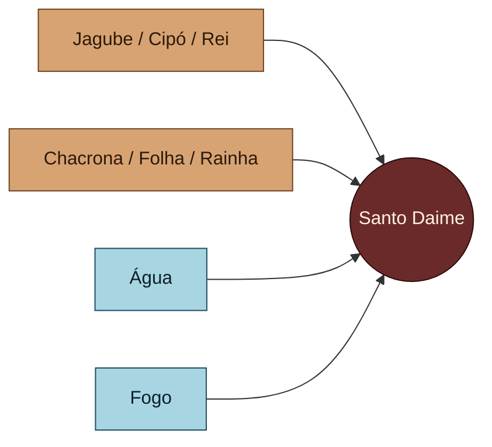

---

## 2. A casinha de feitio

A **casinha de feitio** é o lugar onde tudo acontece. Pense nela como uma **cozinha grande e sagrada**. Dentro dela fica a peça mais importante: a **fornalha**.

A **fornalha** é um fogão gigante, com várias **bocas** (buracos) onde as panelas se apoiam sobre o fogo. Cada casinha tem um número de bocas próprio — a nossa tem **5 bocas**, outras casinhas (como a de Brasília) têm **6 bocas**.

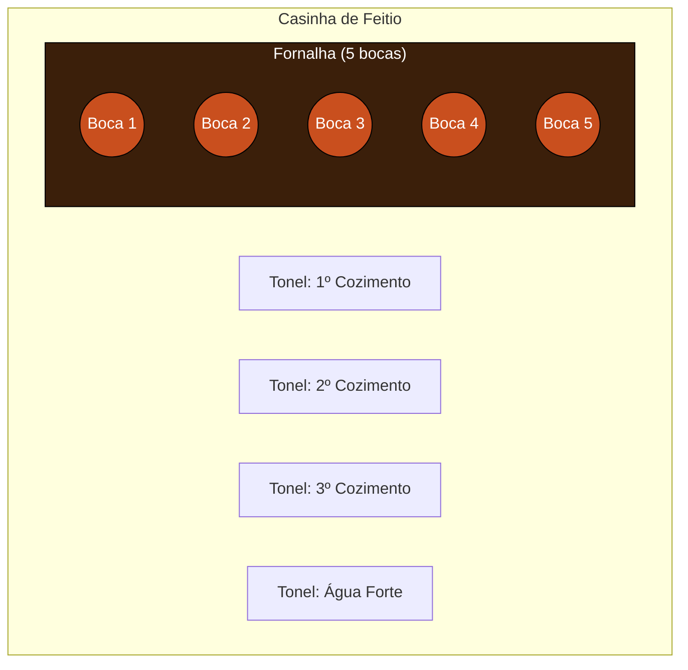

Nas bocas, a gente coloca **panelas grandes** — que aguentam até **120 litros**. Ao redor, ficam **tonéis**, que são baldes grandes onde a gente guarda o líquido que sai das panelas.

---

## 3. Quem faz o feitio

Fazer Daime é trabalho de muita gente, cada um com um papel:

| Personagem | O que faz |
|---|---|
| **Feitor** | O maestro de tudo. Cuida das panelas, dos tempos, dos pontos, das trocas. É quem decide. |
| **Foguista** | Responsável por alimentar a fornalha com lenha. É ele que controla a **temperatura de cada boca** — mais lenha aqui, menos ali. Trabalha lado a lado com o feitor: quando uma panela está atrasada, o foguista reforça o fogo daquela boca. |
| **Batedores** | Homens que batem o jagube na batenção, separando fibra e pó (ver 4.2). |
| **Mulheres da colheita** | Colhem e lavam as folhas da chacrona e entregam prontas na cozinha. |
| **Paneleiro** | Quem **carrega as panelas** — tira e põe no fogo. É trabalho pesado, porque panela cheia é pesada e quente. |
| **Baldeiro** | Quem **realimenta as panelas** com líquido — seja água, seja cozimento vindo dos tonéis. É ele que despeja o conteúdo certo na panela certa, conforme o feitor indica. |

> **Metáfora:** pense numa orquestra. O **feitor é o maestro** — ele não toca todos os instrumentos, mas sem ele o som vira bagunça.

---

## 4. As etapas, em ordem

Antes de entrar nos detalhes, olha o caminho inteiro do feitio:

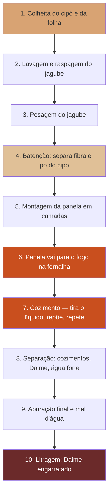

Agora vamos uma por uma.

### 4.1. Colheita e preparo do jagube

- Antes do feitio começar, a gente **estima quantas panelas** vai conseguir fazer, e com isso colhe jagube suficiente, geralmente **dois dias antes**.
- O cipó é **lavado, partido e raspado**.
- Depois é **pesado** — duas vezes: uma logo após colher, outra já limpo e pronto para bater.

> Pensa no jagube como uma cenoura gigante e dura: você colhe, lava, tira a casca suja, e corta em pedaços.

### 4.2. Batenção

Os batedores pegam o jagube limpo e **batem com maço**. A batenção **não transforma o jagube em uma massa só** — ela **separa o cipó em duas partes**:

- **Fibra** — a parte longa e esfiapada (as fibras do cipó).
- **Pó** — a parte interna, mais macia, que se solta em forma de pó.

Esses **dois materiais — fibra e pó — são usados separadamente na montagem da panela** (ver 4.4). Cada um tem um papel diferente nas camadas.

> Pensa numa vassoura de palha: a palha que sai é a fibra; o restinho fino que cai no chão é o pó. A batenção produz os dois, e nenhum é jogado fora.

**Quantidade típica:** mais ou menos **50 kg de jagube** dá para encher **2 panelas**.

### 4.3. As folhas

Em paralelo, as mulheres:

- **Colhem** a chacrona
- **Lavam** as folhas
- **Entregam** prontas na cozinha

### 4.4. Montagem da panela

Na cozinha, a panela é montada em **5 camadas** — como uma lasanha. A ordem é sempre a mesma, **de baixo para cima**:

1. **Fibra de jagube** (no fundo da panela — serve de "cama")
2. **Folha de chacrona**
3. **Pó de jagube** (a camada do meio)
4. **Folha de chacrona**
5. **Fibra de jagube** (cobre por cima)

Ou seja: **fibra → folha → pó → folha → fibra**. A fibra entra no fundo e no topo (protegendo); o pó fica no meio; as folhas ficam intercaladas entre eles.

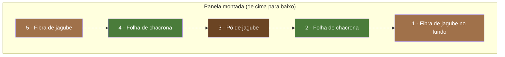

Depois de montada, coloca **água** (ou outro líquido — já vamos ver) e leva para a **boca da fornalha**.

---

## 5. O cozimento — o coração do feitio

Essa é a parte mais delicada. É onde o **feitor** mais trabalha.

### 5.1. O que é "tirar o ponto"

Quando a panela está no fogo, o líquido vai **evaporando** e **ficando mais concentrado**. O feitor fica olhando a panela, acompanhando. Em algum momento ele decide: "agora vamos tirar".

**Tirar** significa: retirar o líquido da panela, deixando só o material sólido (jagube e folha cozidos) dentro dela.

> **Metáfora do chá:** imagine um chá forte. Se você quer um chá mais concentrado, deixa ferver mais tempo. O feitor é quem decide quando o chá está no ponto.

### 5.2. A meta de volume

Cada tiragem tem uma **meta de volume**. Exemplo real do nosso último feitio:

- Panela entra com **60 litros** de líquido
- Meta: **tirar com 30 litros**
- Ou seja, deixa evaporar até ficar metade

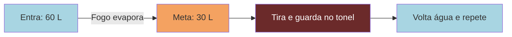

### 5.3. O ciclo de uma panela

Uma panela não é usada uma vez só. Ela **volta ao fogo várias vezes**:

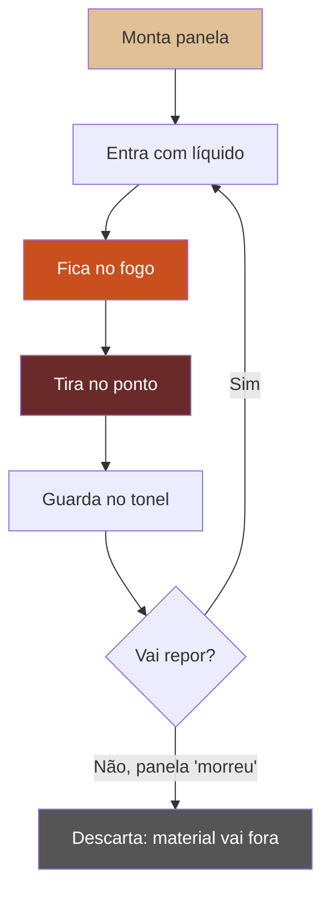

---

## 6. Os nomes dos líquidos

Aqui está o ponto mais importante do feitio — **os líquidos têm nomes diferentes** dependendo de quando saem e do que entrou.

### 6.1. Quando a panela entra com ÁGUA

Se a panela é **nova** e entrou com **água**, o que sai dela se chama **cozimento**.

- **1ª tiragem** de uma panela com água = **1º cozimento**
- A panela volta com água, vai ao fogo, tira de novo = **2º cozimento**
- Repete... **3º, 4º, 5º, 6º cozimento**

A partir da **5ª ou 6ª tiragem** (pode variar), o material já está fraco. A gente **para de contar "cozimento 1, 2, 3..."** e passa a chamar tudo o que sai dali em diante de **água forte**.

**Importante:** água forte **não é uma única tiragem**. A panela continua voltando ao fogo **com água**, repetidas vezes, e cada tiragem dali para frente é água forte. Quantas vezes? Depende do feitio e das necessidades — em algum momento o feitor decide que a panela já não rende mais e ela é descartada. Pode ser mais cedo, pode ser mais tarde.

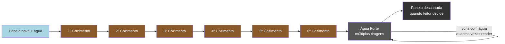

> Cada tonel de cozimento fica **marcado** com o número: Tonel do 1º cozimento, do 2º, etc. **Água forte** de todas as tiragens vai junta no **mesmo tonel** (não se numera).

### 6.2. Quando a panela entra com COZIMENTO (não com água)

Agora vem o pulo do gato. Se a gente colocar uma **panela nova** (cheia de jagube e folha frescos) e em vez de água colocar **um cozimento que já foi tirado antes** — o que sai dela **não é mais cozimento**, é **Daime**.

- **1ª tiragem** dessa panela nova, alimentada com **1º cozimento** = **Daime de 1º grau** (também chamado **"Daime do Mestre"** — o mais concentrado direto da panela)
- Volta com **2º cozimento**, tira de novo = **Daime de 2º grau**
- Volta com **3º cozimento**, tira = **Daime de 3º grau**
- Volta com **4º cozimento**, tira = **Daime de 4º grau**

Depois do 4º grau, a panela já "tirou tudo que tinha de melhor". Daí ela volta com **água** e começa a produzir **cozimento** — que vai alimentar ainda outras panelas novas futuras.

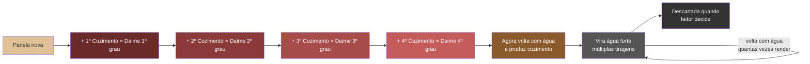

---

## 7. A dança das panelas — duas alimentam uma

Agora o conceito mais importante para entender o feitio.

**Regra geral:** **duas panelas velhas alimentam uma panela nova.**

Por quê? Porque a panela nova precisa entrar com cerca de **60 litros** de líquido, e cada panela velha consegue tirar mais ou menos **30 litros** por cozimento. **30 + 30 = 60.** 

### 7.1. Exemplo do feitio real (quinta e sexta)

**Quinta-feira:**

Foram batidas 2 panelas (a "dupla"). As duas entraram com **água** e foram ao fogo.

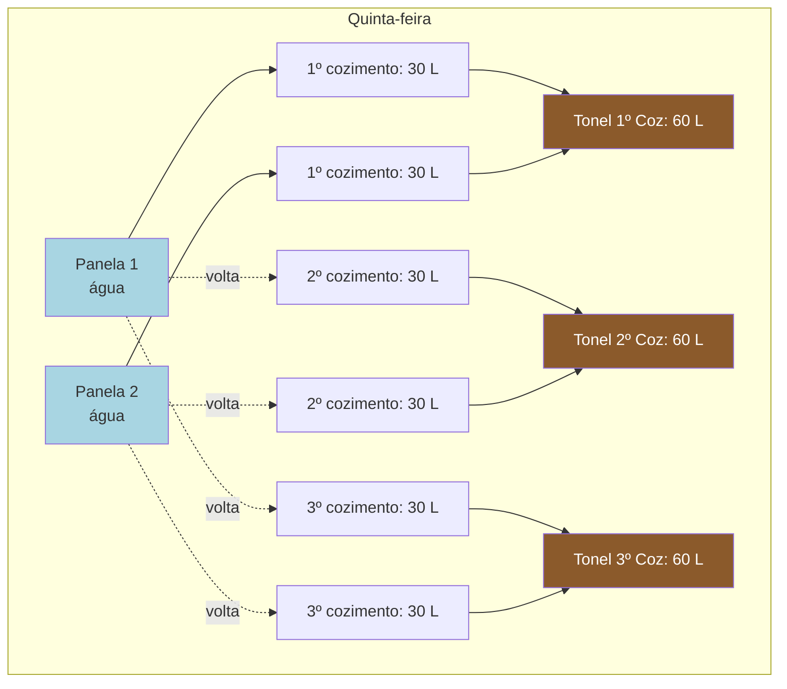

Ao fim da quinta, temos **3 tonéis** de cozimento (1º, 2º e 3º), cada um com **60 litros**. As panelas 1 e 2 ficam guardadas, prontas para continuar sexta.

**Sexta-feira:**

Batem **mais 2 panelas novas** (panelas 3 e 4). Agora entram **4 panelas na fornalha ao mesmo tempo**:

- Panelas 1 e 2 continuam (elas já tiraram 3 cozimentos, vão tirar o 4º agora)
- Panelas 3 e 4 são as novas — e **não entram com água**. Entram com **cozimento**:

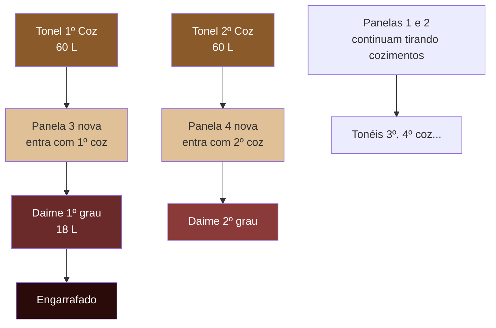

No nosso exemplo real: a panela 3 tirou **18 litros** de Daime de 1º grau — o **"Daime do Mestre"**, mais concentrado direto da panela (vai engarrafado sem apurar).

### 7.2. O ciclo continua

Depois que a panela 3 tirou o 1º grau, ela volta ao fogo com o **3º cozimento** (que estava guardado no tonel). Na próxima tiragem ela dá o **Daime de 2º grau**. Depois volta com o **4º cozimento**, dá o **3º grau**. E assim por diante.

A panela 4, que começou com **2º cozimento**, começa dando **2º grau** direto.

> **Metáfora:** é como se a gente pegasse um chá já pronto e usasse ele (no lugar de água) para fazer um chá novo em cima de folhas frescas. O chá sai muito mais concentrado — já é Daime, não mais cozimento.

---

## 8. As três receitas finais de Daime

No fim do feitio, a gente tem **três tipos de Daime**:

### 8.1. Daime de 1º grau (Daime do Mestre)

- Vem direto da panela nova com 1º cozimento
- É **engarrafado direto**, sem apurar
- É o mais concentrado **direto da panela** (sem passar por apuração)

### 8.2. Daime apurado (2x1 ou 3x1)

- Junta-se o **Daime de 2º + 3º + 4º graus** num caldeirão
- Leva ao fogo para **decantar** (reduzir pela evaporação)
- **2x1** = reduziu pela metade (60 L → 30 L)
- **3x1** = reduziu para um terço (60 L → 20 L)
- Depois é engarrafado

### 8.3. Mel d'água

- No fim, junta-se **todos os cozimentos e águas fortes** que sobraram
- Leva ao fogo e **decanta** até sobrar 5 a 10 litros
- É uma terceira receita, bem concentrada

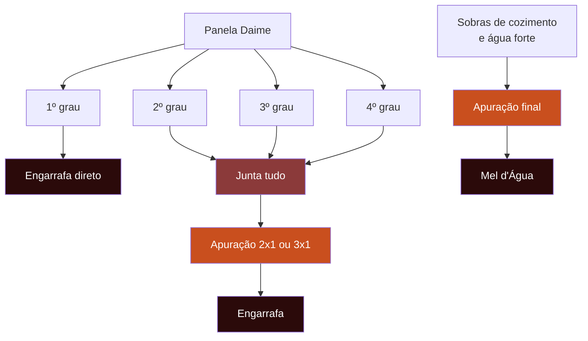

---

## 9. A conta dos volumes — por que existe a dupla

Voltando ao ponto crítico: **a panela nova precisa de 60 litros para entrar**.

Se cada panela velha tira **cerca de 30 litros**, a dupla é perfeita: 30 + 30 = 60.

Mas tirar o ponto é **impreciso**. Às vezes o feitor tira 33, às vezes 29. E se sobrar pouco, **faltam 60 litros** para a próxima panela nova.

### 9.1. A regra de ouro: sobrar nunca é problema, faltar é problema

Por isso o feitor **mira sempre um pouquinho a mais**. Exemplo:

| Meta real | Mira em... | Por quê |
|---|---|---|
| Precisa de 60 L no tonel | Tira 31+31 = 62 L | Margem para evaporação e erro |
| Se tirou 33 na primeira | Tenta tirar 29 na segunda | Corrige na dupla |
| Se tirou 30 na 1ª e 31 na 2ª | Tem 61 L (faltou 1) | Corrige no **próximo cozimento**: mira 63 |

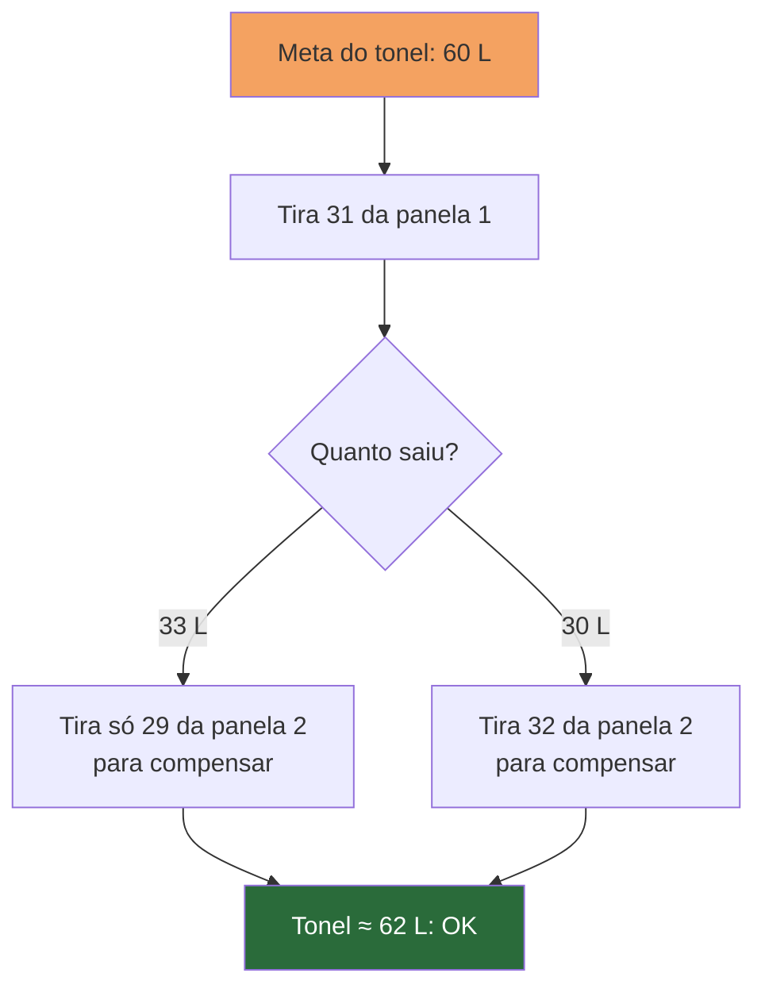

### 9.2. E se mesmo assim sobrar?

Não tem problema! O excesso **vira parte da próxima panela nova**. Se sobraram 3 litros de 1º cozimento, esses 3 litros se juntam a 57 litros de 2º cozimento para encher a próxima panela. O feitor administra essas sobras.

---

## 10. A quantidade de líquido que cabe na panela vai mudando

Um detalhe que confunde iniciantes:

- **Panela nova**: jagube e folha estão **fofos e altos**. Cabe **60 litros** de líquido sem transbordar.
- **Panela que já cozinhou 2-3 vezes**: o material **encolheu**. Agora cabe **só 50-55 litros**.

Então o feitor ajusta a quantidade de líquido que repõe a cada vez, olhando o estado da panela.

---

## 11. O ciclo de vida completo de uma panela

Todo esse percurso pode ser resumido assim:

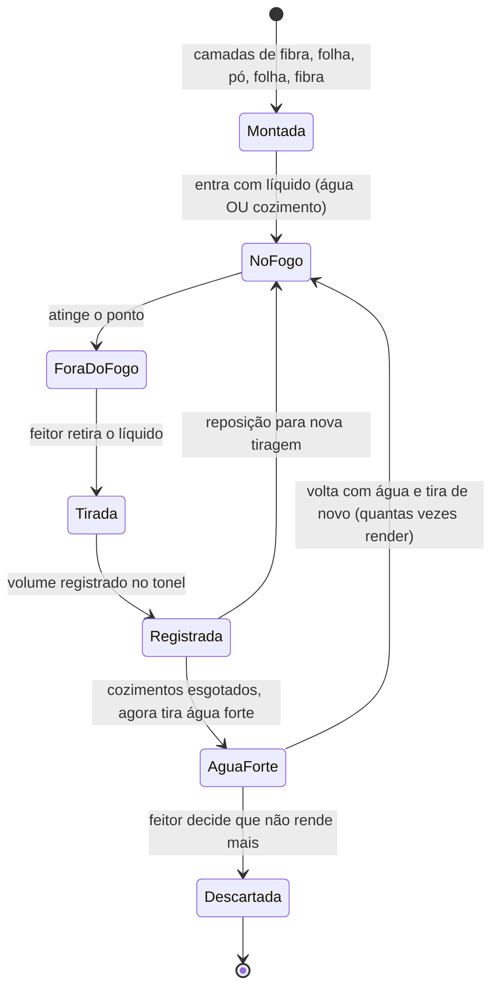

**Estados principais da panela:**

| Estado | Descrição |
|---|---|
| **Montada** | Está com material mas ainda não foi ao fogo |
| **No fogo** | Contando tempo de cozimento |
| **Fora do fogo** | Saiu para tirar, pode estar pausada |
| **Tirada** | Líquido retirado, esperando reposição |
| **Água forte** | Passou dos cozimentos numerados — agora volta ao fogo com água, e cada tiragem vai para o tonel de água forte. Pode ser **repetido várias vezes**, até o feitor decidir descartar |
| **Descartada** | Fim do ciclo — material vai fora, panela é lavada |

---

## 12. Como o feitor usa o aplicativo (visão geral)

O tablet na parede mostra a **fornalha** com as bocas e panelas. O feitor consegue ver de longe:

- **Que panela está em cada boca**
- **Há quanto tempo cada panela está no fogo**
- **Com que líquido ela entrou** (1º coz, 2º coz, água...)
- **Qual é a próxima tiragem esperada** (1º grau, 2º cozimento, etc.)

Quando o feitor clica numa panela, pode:

- **Tirar** (registra fim do cozimento e o volume tirado)
- **Adicionar líquido** (+5, +10, +X litros)
- **Pausar o tempo** (quando a panela sai do fogo temporariamente)
- **Trocar duas panelas de lugar** (clica nas duas, botão de inverter)
- **Dar play** (quando entra no fogo de novo)
- **Descartar** (no fim da vida da panela)

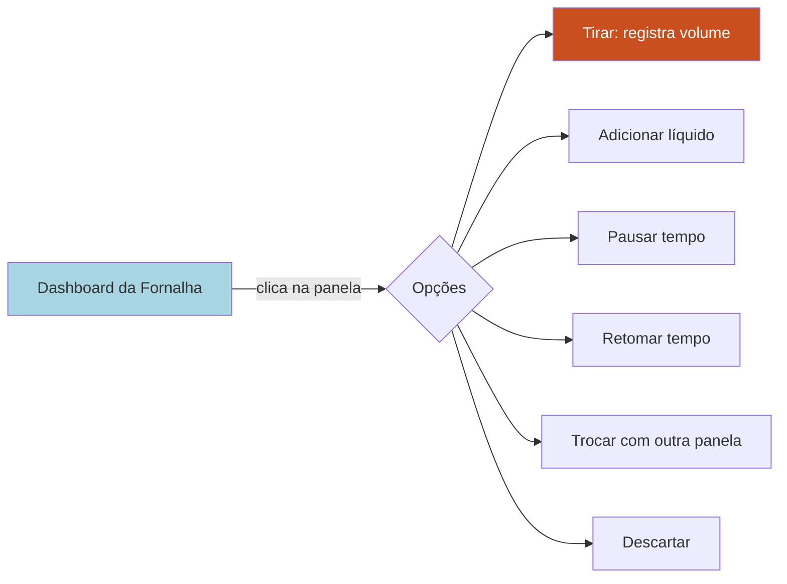

Tudo isso **sem precisar escrever à mão na panela com caneta**, como é feito hoje ("1ºC", "2ºC", "AF", "1ºD"). O aplicativo faz a memória.

---

## 13. Glossário rápido

| Palavra | Significado |
|---|---|
| **Jagube** | Cipó usado como matéria-prima (também: **Rei**) |
| **Chacrona** | Folha usada como matéria-prima (também: **Rainha**) |
| **Fibra** | Parte longa e esfiapada do jagube, produzida na batenção. Usada nas camadas do fundo e do topo da panela |
| **Pó** | Parte interna do jagube, mais macia, em forma de pó. Produzida na batenção e usada na camada do meio |
| **Fornalha** | Fogão grande com várias bocas |
| **Boca** | Cada lugar da fornalha onde cabe uma panela |
| **Feitor** | Quem comanda o feitio |
| **Foguista** | Quem alimenta a fornalha com lenha e controla a temperatura de cada boca |
| **Paneleiro** | Quem carrega as panelas — tira e põe no fogo |
| **Baldeiro** | Quem realimenta as panelas com líquido (água ou cozimento) |
| **Batenção** | Ato de bater o jagube para **separar fibra e pó** |
| **Tiragem** | Ato de retirar o líquido da panela |
| **Tirar o ponto** | Decidir a hora certa de tirar, olhando o volume |
| **Cozimento** | Líquido que sai de panela alimentada com água (1º, 2º, ... até ~6º) |
| **Daime** | Líquido que sai de panela alimentada com cozimento |
| **Daime do Mestre** | Nome do Daime de 1º grau — o mais concentrado direto da panela |
| **Grau do Daime** | 1º, 2º, 3º, 4º — ordem em que são tirados. 1º grau vai direto engarrafado; 2º, 3º, 4º vão para apuração |
| **Água forte** | Líquido que sai da panela depois dos cozimentos numerados. **Múltiplas tiragens** — a panela continua voltando ao fogo com água até o feitor decidir descartar |
| **Apuração** | Levar ao fogo para concentrar por evaporação |
| **2x1 / 3x1** | Reduzir para metade / para um terço. **Quanto maior a razão (3x1 > 2x1), mais concentrado** |
| **Mel d'água** | Daime feito da apuração final de sobras (cozimentos e águas fortes restantes) |
| **Dupla** | Duas panelas que andam juntas, alimentando uma nova |
| **Tonel** | Balde grande onde se guarda o líquido tirado |

---

## 14. Resumo visual — do cipó ao Daime engarrafado

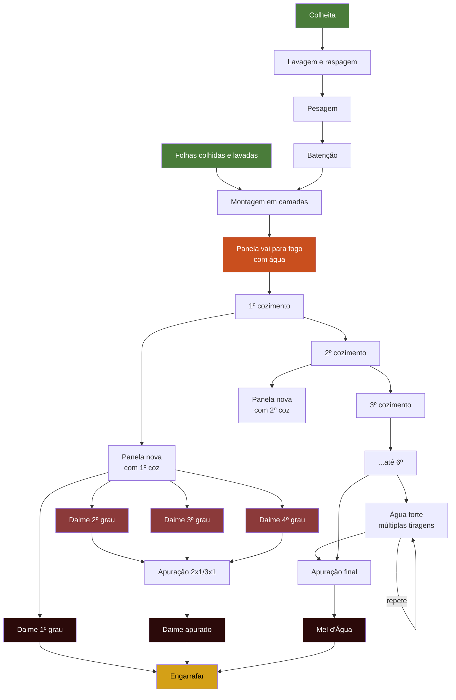

---

## 15. Pontos para lembrar

1. **Duas panelas alimentam uma.** É a regra de ouro do volume.
2. **Panela com água → sai cozimento.** Panela nova com cozimento → sai Daime.
3. **1º grau é o Daime do Mestre** — o mais concentrado direto da panela. Vai direto para o engarrafamento, sem apurar.
4. **Força do Daime não é "cada vez mais forte".** Depende da receita (1º grau, apurado, mel d'água) e da concentração (3x1 é mais concentrado que 2x1).
5. **Sobrar nunca é problema, faltar é problema.** Mire sempre um pouquinho a mais.
6. **A panela tem ciclo de vida.** Dá cozimentos, depois Daime (se alimentada com cozimento), depois volta a dar cozimento e, por fim, água forte — **em várias tiragens** até o feitor descartar.
7. **Jagube = Rei, Chacrona = Rainha.** Os dois são indispensáveis.
8. **O feitor é o maestro; o foguista cuida do fogo; paneleiro carrega, baldeiro alimenta.** O aplicativo é a agenda do feitor — tira peso da memória e do giz escrito na panela.

---

*Este tutorial é a base para o projeto do aplicativo de gestão de feitio. Os termos e diagramas aqui são referência para os documentos de requisitos e projeto.*
